# Veterinary Clinic Management System


A full-stack veterinary clinic management system built with **FastAPI**, **SQL Server**, **React**, **Vite**, and **Docker**.

This project was built as a portfolio-ready application to demonstrate backend architecture, REST API development, authentication, authorization, CRUD workflows, frontend integration, testing, CI/CD basics, pagination, filtering, and Docker-based deployment preparation.

---

## Overview

The Veterinary Clinic Management System helps clinic staff manage daily operational data such as owners, pets, appointments, users, medical records, and audit logs.

The application includes:

* JWT-based authentication
* Role-based authorization
* Admin user management
* Owner management
* Pet management
* Appointment scheduling
* Medical records management
* Audit logging
* Dashboard statistics
* Forgot password flow with email reset link
* Reset password flow using secure token
* Change password flow
* Advanced filtering and pagination
* Custom confirmation modal for destructive actions
* React frontend
* FastAPI backend
* SQL Server database
* Automated tests
* GitHub Actions CI
* Docker and Docker Compose setup

---

## Tech Stack

### Backend

* Python
* FastAPI
* SQL Server
* PyODBC
* Pydantic
* python-jose for JWT creation and validation
* Passlib / Bcrypt
* Pytest

### Frontend

* React
* Vite
* JavaScript
* Axios
* React Router
* React Hot Toast
* CSS

### DevOps / Tooling

* Docker
* Docker Compose
* GitHub Actions
* Environment variables
* Nginx for frontend production build

---

## Main Features

### Authentication and Security

* JWT login
* Protected API routes
* Protected frontend routes
* Role-based access control
* Forgot password flow with email reset link
* Reset password flow using secure token
* Change password flow
* Password hashing with bcrypt

---

### Role-Based Access Control

The system supports three main roles:

| Role | Permissions |
| --- | --- |
| Admin | Full access to users, audit logs, pets, owners, appointments, and medical records |
| Veterinarian | Can manage medical records and appointments, with limited administrative access |
| Receptionist | Can manage owners, pets, and appointments, with read-only access to medical records |

---

### Dashboard

* Total owners
* Total pets
* Total appointments
* Recent appointments
* Clickable dashboard cards for quick navigation

---

### Owner Management

* Create owners
* Update owners
* Delete owners
* Search owners
* Paginated owner list
* View owner details

---

### Pet Management

* Create pets
* Update pets
* Delete pets
* Search pets
* Filter pets by species
* Filter pets by owner
* Paginated pet list
* Link pets to owners
* View pets with owner information

---

### Appointment Management

* Create appointments
* Update appointments
* Delete appointments
* View appointments with pet information
* Search appointments by reason or pet
* Filter appointments by pet
* Filter appointments by date range
* Paginated appointment list
* Role-based UI actions

---

### Medical Records

* Create medical records
* Update medical records
* Delete medical records as Admin
* View medical history by pet
* Search records by diagnosis, treatment, notes, or pet
* Filter medical records by pet
* Filter medical records by visit date range
* Paginated medical record list
* Store diagnosis, treatment, weight, notes, and visit date

---

### User Management

* Admin-only user management
* Create users
* Assign roles
* Activate users
* Deactivate users
* Search users by username or email
* Filter users by role
* Filter users by active or inactive status
* Paginated user list

---

### Audit Logs

* Track create, update, and delete actions
* Store user ID, action, entity, entity ID, and timestamp
* Admin-only access
* Filter audit logs by action
* Filter audit logs by entity
* Filter audit logs by user ID
* Filter audit logs by date range
* Paginated audit log list

---

## Screenshots

### Login


### Dashboard


### Pets

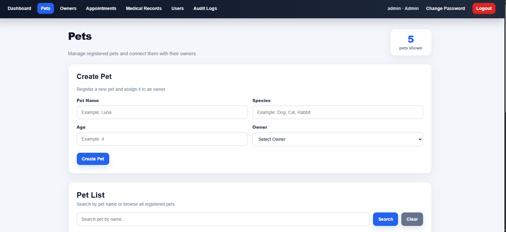

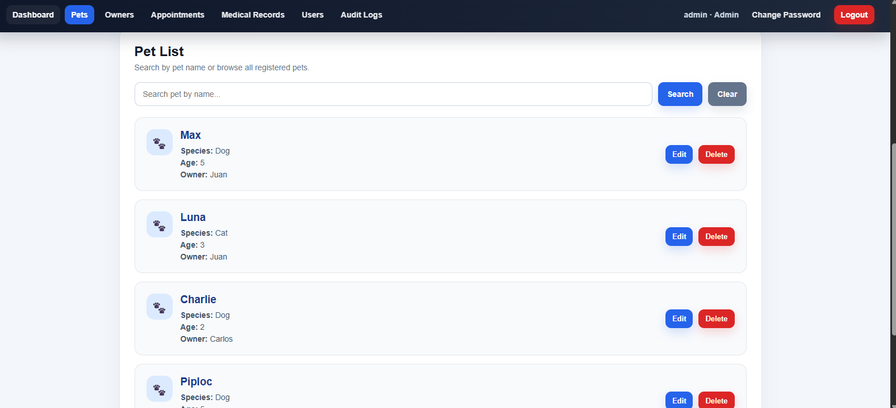

### Owners

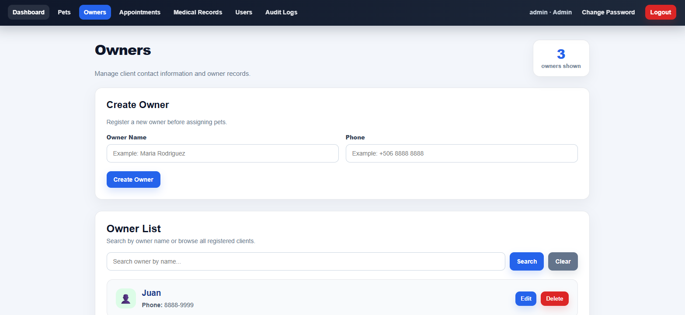

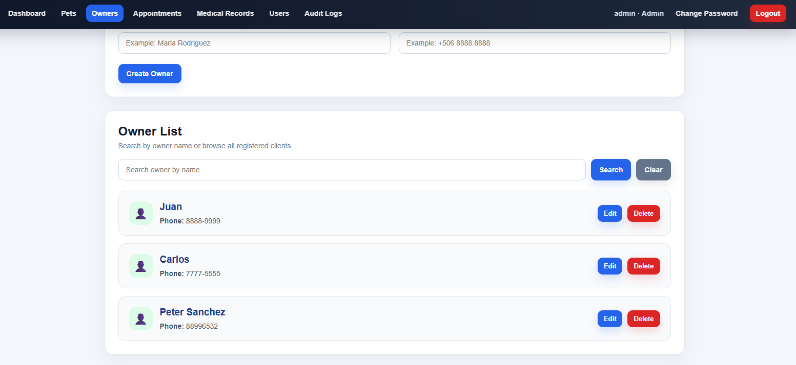

### Appointments

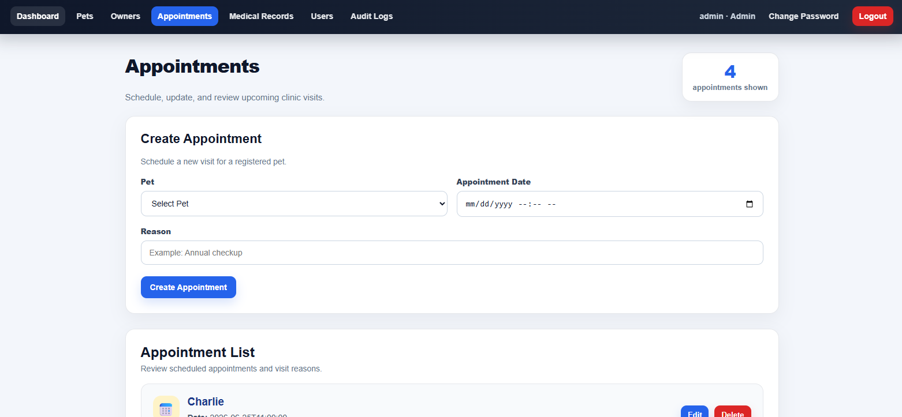

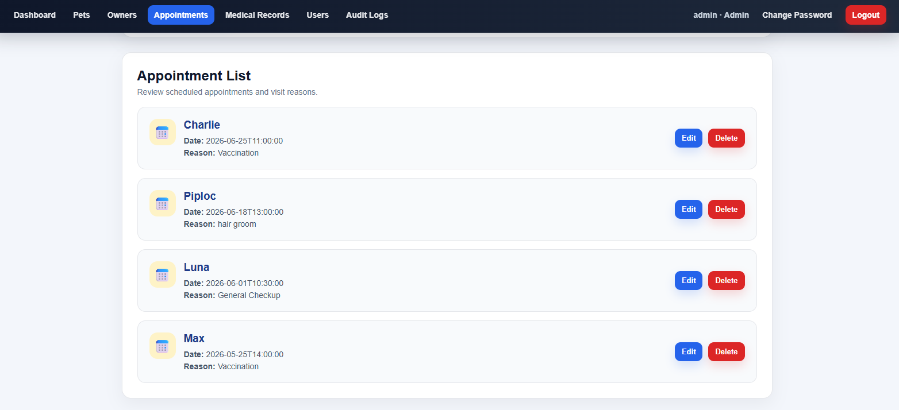

### Medical Records

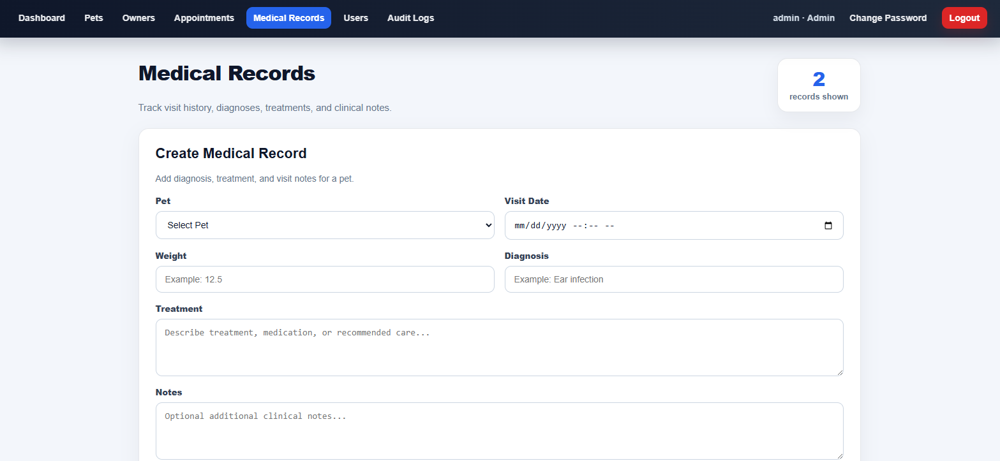

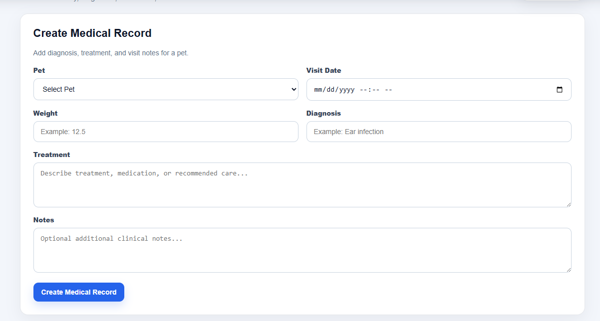

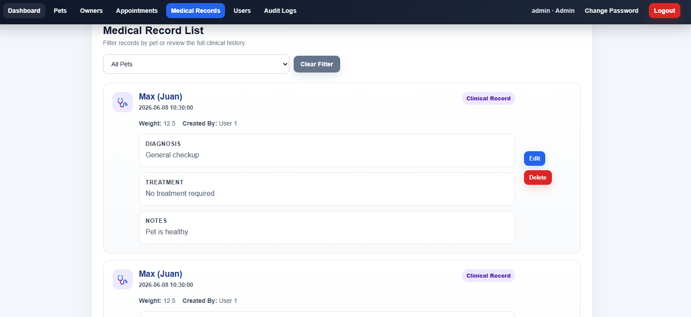

### Users

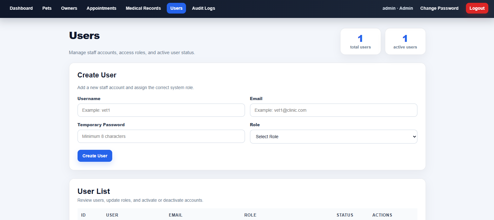

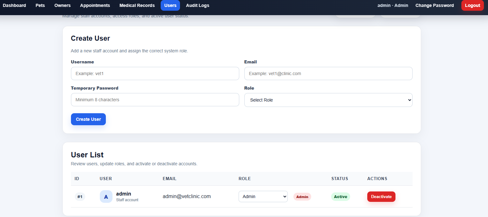

### Audit Logs

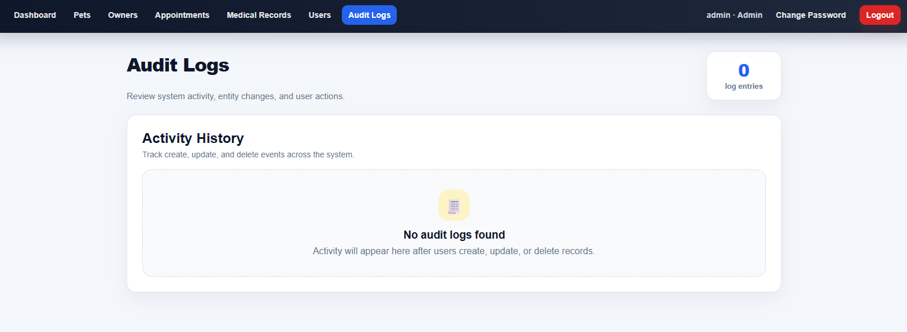

### Change Password

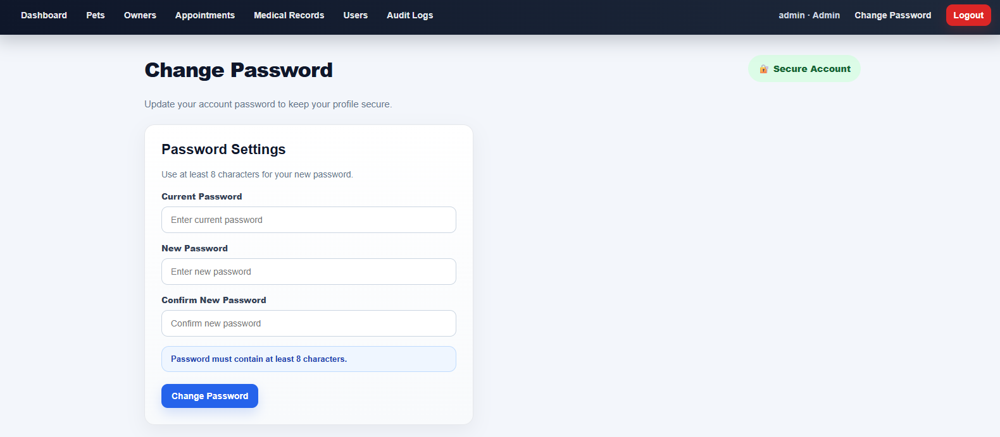

### Forgot Password / Email Reset Link

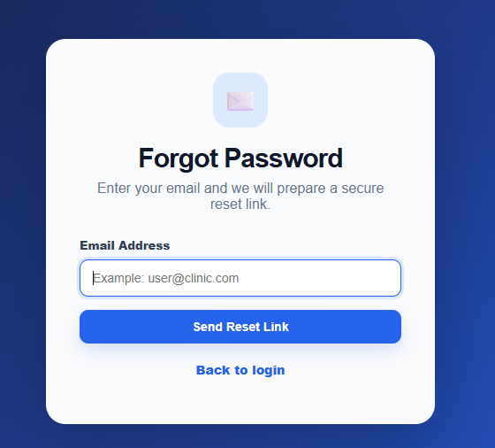

---

## Project Structure

```text
vet_clinic/
│
├── api/
│   ├── handlers/
│   ├── routes/
│   └── schemas/
│
├── app/
│   ├── bootstrap.py
│   └── dependencies.py
│
├── auth/
├── config/
├── controllers/
├── database/
├── exceptions/
├── models/
├── repositories/
├── services/
├── validators/
├── views/
├── tests/
│
├── frontend/
│   ├── public/
│   ├── src/
│   │   ├── components/
│   │   ├── hooks/
│   │   ├── pages/
│   │   ├── services/
│   │   └── styles/
│   ├── Dockerfile
│   └── nginx.conf
│
├── .github/
│   └── workflows/
│       └── tests.yml
│
├── Dockerfile
├── docker-compose.yml
├── requirements.txt
├── main.py
├── main_api.py
├── .env.example
└── README.md
```

---

## Backend Architecture

The backend follows a layered architecture:

```text
API Routes
↓
Services
↓
Repositories
↓
Database
```

### Main Backend Layers

* **Routes:** FastAPI endpoints
* **Schemas:** Request and response validation
* **Services:** Business logic
* **Repositories:** Database access
* **Models:** Domain objects
* **Validators:** Input and business validations
* **Exception handlers:** Centralized API error handling

This separation makes the code easier to test, maintain, and extend.

---

## Frontend Architecture

The frontend is built with React and Vite.

Main frontend structure:

```text
src/
├── components/
├── hooks/
├── pages/
├── services/
└── styles/
```

### Main Frontend Responsibilities

* **Pages:** Main screens and workflows
* **Components:** Reusable UI sections
* **Hooks:** Reusable frontend logic, such as confirmation modal behavior
* **Services:** API calls using Axios
* **Styles:** Global UI styling
* **Protected routes:** Route-level authentication
* **Permission service:** Role-based UI behavior

---

## API Highlights

The backend includes standard CRUD endpoints as well as paginated endpoints for larger datasets.

### Core API Areas

```text
/api/v1/auth
/api/v1/owners
/api/v1/pets
/api/v1/appointments
/api/v1/medical-records
/api/v1/users
/api/v1/audit-logs
/api/v1/dashboard
```

### Paginated Endpoints

```text
GET /api/v1/owners/paginated
GET /api/v1/pets/with-owner-paginated
GET /api/v1/appointments/paginated
GET /api/v1/medical-records/paginated
GET /api/v1/audit-logs/paginated
GET /api/v1/users/paginated
```

### Example Paginated Appointment Request

```text
GET /api/v1/appointments/paginated?page=1&page_size=10&search=vaccine&pet_id=3&date_from=2026-06-01 00:00:00&date_to=2026-06-30 23:59:59
```

### Example Paginated Medical Record Request

```text
GET /api/v1/medical-records/paginated?page=1&page_size=10&search=infection&pet_id=3&date_from=2026-06-01 00:00:00&date_to=2026-06-30 23:59:59
```

### Example Paginated Audit Log Request

```text
GET /api/v1/audit-logs/paginated?page=1&page_size=10&action=CREATE&entity=Pet&user_id=1&date_from=2026-06-01 00:00:00&date_to=2026-06-30 23:59:59
```

### Example Paginated User Request

```text
GET /api/v1/users/paginated?page=1&page_size=10&search=juan&role_id=1&active=true
```

### Paginated Response Format

Paginated endpoints return a consistent response format:

```json
{
  "items": [],
  "total": 0,
  "page": 1,
  "page_size": 10,
  "total_pages": 0
}
```

---

## Environment Variables

Create a `.env` file in the project root based on `.env.example`.

Example:

```env
DB_SERVER=localhost
DB_DATABASE=VetClinic
DB_DRIVER=ODBC Driver 18 for SQL Server

DB_USERNAME=
DB_PASSWORD=

JWT_SECRET=change-this-secret-key
JWT_ALGORITHM=HS256

OPENAI_API_KEY=

APP_NAME=Veterinary Clinic
APP_ENV=development

FRONTEND_URL=http://localhost:5173
CORS_ORIGINS=http://localhost:5173,http://127.0.0.1:5173,http://localhost:3000
PASSWORD_RESET_EXPIRE_MINUTES=30

LOG_FILE=vet_clinic.log
```

> The real `.env` file should not be committed to GitHub.

---

## Running the Project Locally

### 1. Backend Setup

Create and activate a virtual environment:

```bash
python -m venv .venv
```

Windows PowerShell:

```bash
.venv\Scripts\activate
```

Install dependencies:

```bash
pip install -r requirements.txt
```

Run the FastAPI backend:

```bash
uvicorn main_api:app --reload
```

Backend URL:

```text
http://127.0.0.1:8000
```

Swagger API documentation:

```text
http://127.0.0.1:8000/docs
```

---

### 2. Frontend Setup

Navigate to the frontend folder:

```bash
cd frontend
```

Install dependencies:

```bash
npm install
```

Run the development server:

```bash
npm run dev
```

Frontend URL:

```text
http://localhost:5173
```

---

## Running with Docker

This project includes Docker support for:

* FastAPI backend
* React production frontend served with Nginx

SQL Server is expected to run externally on the host machine for the current Docker setup.

Build containers:

```bash
docker compose build
```

Start containers:

```bash
docker compose up
```

Frontend URL:

```text
http://localhost:3000
```

Backend URL:

```text
http://localhost:8000
```

Swagger documentation:

```text
http://localhost:8000/docs
```

Stop containers:

```bash
docker compose down
```

---

## SQL Server Notes for Docker

When running the backend inside Docker, Windows Authentication is not used.

For Docker execution, configure SQL Server Authentication with a SQL login and password.

Example `.env` values for Docker-compatible database access:

```env
DB_USERNAME=vet_app_user
DB_PASSWORD=your_password_here
```

The `docker-compose.yml` file uses:

```text
host.docker.internal
```

so the backend container can connect to SQL Server running on the host machine.

---

## Testing

Run backend tests:

```bash
pytest
```

Run tests with coverage:

```bash
pytest --cov=. --cov-report=term-missing
```

Run the frontend production build:

```bash
cd frontend
npm run build
```

The project includes tests for:

* Services
* API routes
* Authentication
* Password reset
* User management
* Role-protected workflows

---

## Continuous Integration

GitHub Actions runs automatically on push and pull request.

The CI workflow validates:

* Backend dependency installation
* Backend test execution
* Frontend dependency installation
* Frontend production build

Workflow file:

```text
.github/workflows/tests.yml
```

---

## API Documentation

When the backend is running, FastAPI automatically provides Swagger documentation at:

```text
http://127.0.0.1:8000/docs
```

or when running with Docker:

```text
http://localhost:8000/docs
```

---

## Demo Workflow

A typical demo flow for this project:

1. Login as an Admin user.
2. Review dashboard statistics.
3. Create an owner.
4. Create a pet linked to that owner.
5. Search, filter, and paginate pet records.
6. Create an appointment for the pet.
7. Filter appointments by pet and date range.
8. Add a medical record.
9. Search and filter medical records.
10. Review audit logs.
11. Filter audit logs by action, entity, user, or date range.
12. Create or deactivate a user.
13. Filter users by role and active status.
14. Test role-based access with a Veterinarian or Receptionist account.
15. Test forgot password and reset password flows using the email reset link.

---

## Demo Credentials

Demo credentials are not included in this repository for security reasons.

For local testing, create an Admin user directly in the database or through your setup script, then use the application to create additional staff users.

Example roles:

```text
1 = Admin
2 = Veterinarian
3 = Receptionist
```

---

## Security Notes

* Passwords are hashed using bcrypt.
* JWT tokens are used for authenticated requests.
* Role-based dependencies protect backend endpoints.
* Frontend route protection prevents unauthenticated navigation.
* Destructive actions use confirmation modals.
* Sensitive values are managed through environment variables.
* The real `.env` file should never be committed.

---

## Portfolio Highlights

This project demonstrates:

* Full-stack application development
* REST API design with FastAPI
* SQL Server integration through repositories
* JWT authentication
* Role-based authorization
* Frontend protected routes
* Frontend permission-based UI rendering
* CRUD workflows across multiple business entities
* Advanced filtering and pagination
* Audit logging
* Password reset workflow
* Automated tests
* GitHub Actions CI
* Dockerized backend and frontend setup
* Clean layered backend architecture
* React component-based frontend architecture

---

## Future Improvements

Possible future improvements include:

* Appointment reminder notifications
* Full SQL Server Docker container setup
* Cloud deployment
* Refresh token support
* More detailed audit log descriptions
* Export reports to CSV or PDF
* Automated email notifications
* More dashboard charts and analytics
* End-to-end frontend tests

---

## Author

**Juan Andrey Ureña Chaves**

Costa Rica